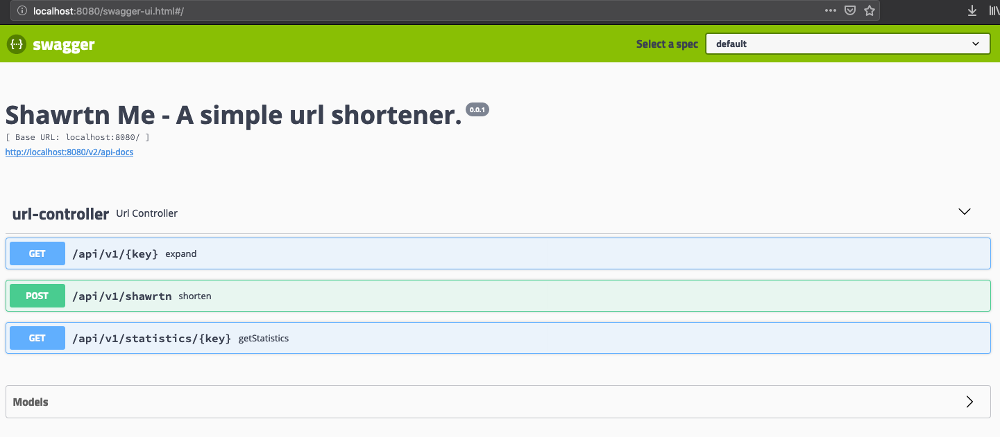

# shawrtn.me
URL shortener

### Stack
* Java8
* Spring Boot
* JUnit / Mockito
* Docker
* Redis
* MongoDB

### Setup
1. Clone this repository
2. Build package jar
```
mvn clean package
```
3. Docker compose build and start
```
docker-compose build
docker-compose up -d
```
### Run tests
```
mvn test
```

### API

**Shorten a link:**
```
POST /api/v1/shawrtn
```
```
curl -v -H "Content-Type: application/json" -X POST -d '{"longUrl":"https://salilwalavalkar.github.io/"}' http://localhost:8080/api/v1/shawrtn
```

**Expand a link:**
```
GET /api/v1/KEY
```
```
curl -v -X GET http://localhost:8080/api/v1/b
```

**Statistics:**
```
GET /api/v1/KEY
```
```
curl -v -X GET http://localhost:8080/api/v1/b
```

### Swagger UI

```
http://localhost:8080/swagger-ui.html
```


